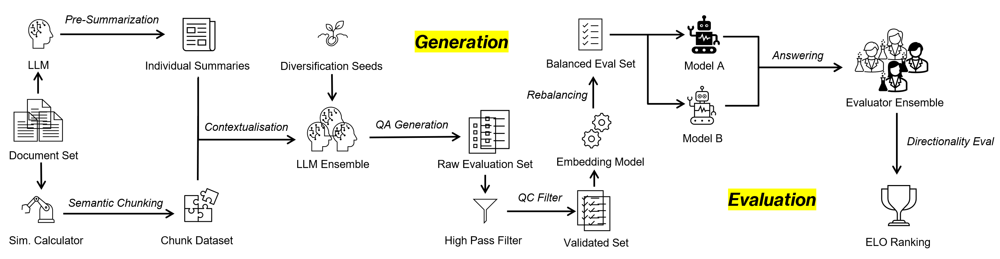

<!--
  README.md (Partial Snippet)
  ===========================
  This is a work-in-progress README for YourBench. 
  There is more coming soon—stay tuned!
-->

<div align="center">

<!-- Replace the paths below with your actual SVG logo paths or PNGs 
     Make sure these files exist in docs/assets or an accessible directory -->

<picture>
  <source media="(prefers-color-scheme: dark)" srcset="docs/assets/yourbench_banner_dark_mode.svg">
  <source media="(prefers-color-scheme: light)" srcset="docs/assets/yourbench_banner_light_mode.svg">
  
</picture>

<h2>YourBench: A Dynamic Benchmark Generation Framework</h2>

<p>
  <strong>
    [<a href="https://github.com/huggingface/yourbench">GitHub</a>] 
    &middot; 
    [<a href="https://huggingface.co/datasets/sumuks/tempora">Dataset</a>] 
    &middot; 
    [<a href="https://github.com/huggingface/yourbench/tree/main/docs">Documentation</a>]
    &middot;
    [<a href="https://github.com/huggingface/yourbench/blob/main/docs/academic/paper.pdf">Paper</a>]
  </strong>
</p>

<!-- Example badges -->
<a href="https://github.com/huggingface/yourbench/stargazers">
  
</a>

<p align="center">
  <a href="https://youtu.be/mhszO6kZSbI">
    
    <br>
    
    <br>
    <em>Watch our 3-minute demo of the YourBench pipeline</em>
  </a>
</p>

</div>

---

> **YourBench** is an open-source framework for generating domain-specific benchmarks in a zero-shot manner. It aims to keep your large language models on their toes—even as new data sources, domains, and knowledge demands evolve.

**Highlights**:
- **Dynamic Benchmark Generation**: Produce diverse, up-to-date questions from real-world source documents (PDF, Word, HTML, even multimedia).
- **Scalable & Structured**: Seamlessly handles ingestion, summarization, and multi-hop chunking for large or specialized datasets.
- **Zero-Shot Focus**: Emulates real-world usage scenarios by creating fresh tasks that guard against memorized knowledge.
- **Extensible**: Out-of-the-box pipeline stages (ingestion, summarization, question generation), plus an easy plugin mechanism to accommodate custom models or domain constraints.

---

## Quick Start (Alpha)

```bash
# 1. Clone the repo
git clone https://github.com/huggingface/yourbench.git
cd yourbench

# Use uv to install the dependencies
# pip install uv # if you do not have uv already
uv venv
source .venv/bin/activate
uv sync
uv pip install -e .

# 3. Get a key from https://openrouter.ai/ and add it to the .env file (or make your own config with a different model!)
touch .env
echo "HF_TOKEN=<your_huggingface_token>" >> .env
echo "HF_ORGANIZATION=<your_HF_username_or_organization>" >> .env

# 4. Run the pipeline with an example config
yourbench run --config configs/example.yaml
```

**Note**: The above instructions are a work-in-progress, and more comprehensive usage info will be provided soon.


# Process Flow




## Key Features

- **Automated Benchmark Generation**  
  Generate question-answer pairs that test LLMs on specific domains or knowledge slices, derived directly from your raw documents.

- **Flexible Pipeline**  
  Each stage (ingestion, summarization, chunking, multi-/single-hop QG, deduplication) can be enabled or disabled via YAML config. Fine-grained control allows minimal or comprehensive runs.

- **Robust Config System**  
  A single YAML config controls model roles, data paths, chunking parameters, question generation instructions, deduplication thresholds, etc.

- **Multi-Model Ensemble Support**  
  Use different LLMs for ingestion, summarization, question generation, or answering. This fosters broader coverage and question style diversity.

- **Deduplication & Quality Filtering**  
  Automatic grouping of near-duplicate questions to prune and keep a curated set.

- **Extensive Logging & Analysis**  
  Built-in modules measure dataset coverage, question distribution, difficulty metrics, and more. 

- **Public or Private**  
  Optionally push ingested or generated data to the Hugging Face Hub or keep it local.

- **Extensible**  
  Each pipeline step is modular. Easily add custom question-generation prompts, chunking logic, or domain-specific expansions.

---

## Core Concepts & Workflow

YourBench follows a multi-stage approach:

1. **Document Ingestion**  
   Convert PDFs, HTML, Word, or text into a standardized Markdown format.

2. **Summarization**  
   Generate a concise "global summary" for each document, using a designated summarization LLM.

3. **Chunking**  
   Split or chunk documents (and optionally combine multiple smaller segments) based on text similarity or length constraints.

4. **Question Generation**  
   - **Single-Shot**: Create straightforward, single-chunk questions.  
   - **Multi-Hop**: Combine multiple chunks to produce more complex, integrative questions.

5. **Deduplication**  
   Remove or group near-duplicate questions across your dataset using embedding-based similarity.

6. **Analysis**  
   Evaluate question distribution, difficulty, coverage, or run custom analyses.

7. **Export**  
   The resulting question sets can be stored locally or uploaded as a new dataset on the Hugging Face Hub.

---

## 🧰 Development

We use:
- [Ruff](https://github.com/astral-sh/ruff) for code formatting and linting
- [pytest](https://docs.pytest.org/) for testing


## 🤝 Contributing

1. Fork the repository
2. Create your feature branch (`git checkout -b feature/amazing-feature`)
3. Install development dependencies
4. Make your changes
5. Run tests and ensure code style compliance
6. Commit your changes (`git commit -m 'Add amazing feature'`)
7. Push to the branch (`git push origin feature/amazing-feature`)
8. Open a Pull Request

## 📄 License

This project is licensed under the MIT License - see the [LICENSE](LICENSE) file for details.

## 🙏 Acknowledgments

- [LiteLLM](https://github.com/BerriAI/litellm) for model inference
- [Sentence Transformers](https://www.sbert.net/) for semantic embeddings
- [Hugging Face](https://huggingface.co/) for dataset infrastructure
